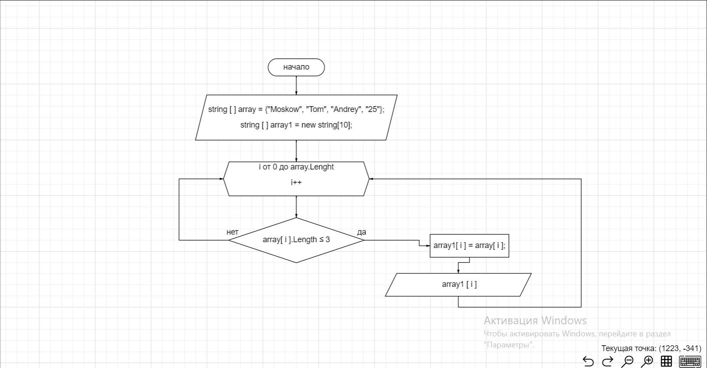

# Начинаем работу 

 1. **Создали репозиторий в GitHub**

 2. **Блок-схема нашей программы**
 

 3. **Написали программу** 
 (программа также есть в папке Ex01)
 Console.Clear();

string [] array = {"Moskow", "Tom", "Andrey", "25"};

Console.Write("[ ");
for(int i = 0; i < array.Length; i++ )
{
    Console. Write($"{array[i]}, ");
}
Console.Write("]");
Console.WriteLine();

string [] array1 = new string[10];
Console.Write("[ ");
for(int i = 0; i < array.Length; i++ )
{
    if (array[i].Length <=3)
    {
        array1[i] = array[i];
       Console. Write($"{array1[i]}, ");
    }
}
Console.Write("]");

  
